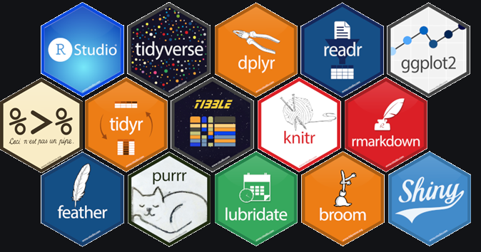
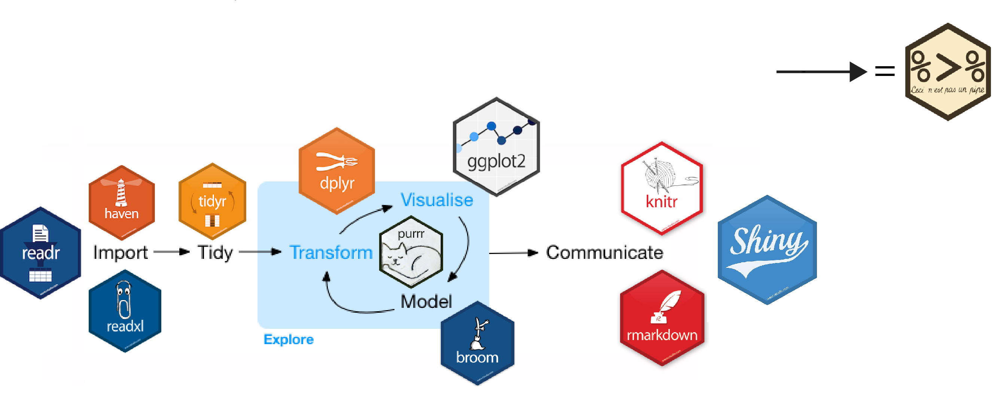
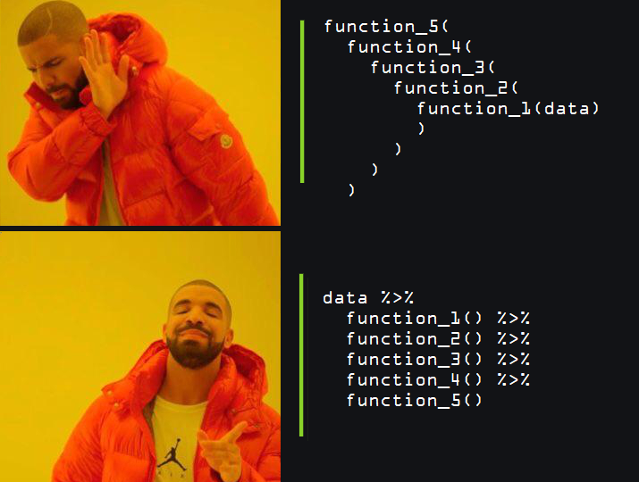
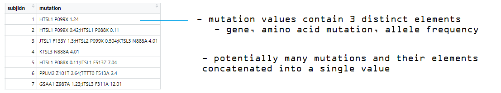

```{r, include = F}
knitr::opts_chunk$set(warning = F, comment = "", cache = F, message = F)

#load dependencies

#devtools::install_github("EvaMaeRey/flipbookr")
library(flipbookr) 

library(xaringan)
library(flextable)
library(tidyverse)
library(lubridate)
library(janitor)
library(tidyr)
library(ggdark)
library(lubridate)
library(readxl)

#load example data sets
source("assets/scripts/example_data.R")
```

class: inverse, title-slide
<div style= "float:right;position: relative; left: 30px; bottom: -450px;">
```{r echo=FALSE, out.width="150px", fig.align='right'}
 
```
</div>
<br>
<br>
<br>
# Data Manipulation with R
## ODA R Learning Series
<br>
### Matthew Kumar
### Bayer
### December 4, 2020

---
class: inverse, bullet

# Agenda

1. Introduction

2. Data manipulation techniques

3. Data tidying techniques

4. Resources

5. Exercises

---
class: inverse, bullet

# The Approach

- Introduce the tidyverse ecosystem 

- Provide a tour of essential data manipulation packages and techniques

- Use minimal, <span style="color:#89D329">relatable</span> examples to demonstrate core concepts

- Provide a head start to **continued** learning


---
class: inverse, center, middle

# Tidyverse

---
class: inverse

<div style= "float:right;position: relative; left: 30px; bottom: -250px;">
```{r echo=FALSE, out.width="500px", fig.align='right'}
 
```
</div>
  
# Tidyverse
  
*"The tidyverse is an **opinionated collection of R packages** designed for data science. All packages share an underlying design philosophy, grammar, and data structures."*
<p style="margin-left:13%;color:#89D329">-Tidyverse.org</p>
  
<br>
<br>
<br>
  
- Packages play well with each other

- Maintained, tested and documented

- Inspired, growing ecosystem

- Coverage along the data analytic workflow

- `> install.packages("tidyverse")`


---
# A Tidy Workflow
  
```{r echo=FALSE, out.width="900px", fig.align='center', fig.cap = "Image Credit: https://beanumber.github.io/tidy-databases"}
 
```

---
class: inverse
  
# Pipe Operator, %>%

- Used in the Tidyverse to "chain" together parts of a pipeline
<br>
<br>
  
> data %>%
  
> &nbsp;&nbsp;&nbsp;&nbsp;function_1() %>%
  
> &nbsp;&nbsp;&nbsp;&nbsp;function_2() %>%
  
> &nbsp;&nbsp;&nbsp;&nbsp;...

<br>

- A pipeline typically starts with a data source


- Data is passed as input to a function and is evaluated


- That output is then passed as input to the next function


- Rinse and repeat
  
```{r echo=FALSE}
htmltools::img(src = knitr::image_uri("assets/images/pipehex.png"), 
               alt = 'logo', 
               style = 'position:absolute; top:0; right:0; padding:30px; width: 200px; height: 200px')
```

---
class: inverse

# Pipe Operator, %>%

```{r echo=FALSE, out.width="500px", out.height="400px", fig.align='center'}
 
```

---
`r chunk_reveal("code_2", widths = c(1,1), title = "# Pipe Operator, %>%")`

```{r code_2, include = FALSE, comment = ""}
# Data Layer
adsl %>%
  filter(SAFFL == "Y") %>%
  group_by(TRTP) %>%
  summarise(N   = n(),
            M   = mean(AGE),
            SD  = sd(AGE)) %>%
  
  # Table Layers
  flextable() %>%
  
  # Rounding
  colformat_num(digits = 2) %>%
  
  # Header
  add_header_lines("Table 1: Age by Treatment") %>%
  
  # Footer
  add_footer_lines("M = Mean, SD = Standard Deviation ") %>%
  
  # Theme
  theme_tron()


```
---
`r chunk_reveal("code_3", widths = c(1.5 ,3), title = "# Pipe Operator, %>%", float="left", chunk_options="fig.width=10, fig.retina=2")`


```{r code_3, include = FALSE, comment = "", message = FALSE, echo=FALSE, warning=FALSE}
# Data Layer
adsl %>%
  filter(SAFFL == "Y") %>%
  
  # Plot Layers
  ggplot() +
  
  # Mapping
  aes(x = HEIGHT, 
      y = WEIGHT, 
      fill = TRTP) +
  
  # Point
  geom_point(shape = 21,
             color = "black", 
             size = 4) +
  
  # Bayer Colors
  scale_fill_manual(values=c("#89D329",
                             "#FF3162")) +
  
  # Split by TRTP
  facet_grid( ~ TRTP) +
  
  # Fit Model
  geom_smooth(method = "lm") +
  
  # Change Theme
  my_theme()
```

---
`r chunk_reveal("code_4", widths = c(1,1), title = "# Typical %>% Use")`

```{r code_4, include = FALSE, comment = ""}
# Data Processing
step1 <- adsl %>%
          filter(SAFFL == "Y") %>%
          group_by(TRTP) %>%
          summarise(N   = n(),
                    M   = mean(AGE),
                    SD  = sd(AGE)) 

# Inspect, Debug, etc
step1

# Table
table1 <- step1 %>%
          flextable() %>%
          colformat_num(digits = 2) %>%
          add_header_lines("Table 1: Age by Treatment") %>%
          add_footer_lines("M = Mean, SD = Standard Deviation ") %>%
          theme_tron()

# Inspect, Debug, etc
table1
```
---
class: inverse, center, middle

# Data Manipulation

---
class: inverse

# dplyr
## Grammar of Data Manipulation

- Data manipulation is driven by a set of SQL-like verbs

  - `select()` 
  
  - `filter()` 
  
  - `arrange()` 
  
  - `mutate()` 
  
  - `summarise()` 
  
  - `group_by()`  

- Combinations of these can be chained using the **%>%**
  
  
```{r echo=FALSE}
htmltools::img(src = knitr::image_uri("assets/images/dplyr.png"), 
               alt = 'logo', 
               style = 'position:absolute; top:0; right:0; padding:30px; width: 175px; height: 175px')
```

---
class: inverse, bullet

# dplyr
## select()

- The `select()` verb is used to choose columns


- Can specify selections in flexible ways


- Similar to a SAS `keep` statement or PROC SQL `select` statement


- Provisions for wild card select (SAS `:`)


```{r echo=FALSE}
htmltools::img(src = knitr::image_uri("assets/images/dplyr.png"), 
               alt = 'logo', 
               style = 'position:absolute; top:0; right:0; padding:30px; width: 175px; height: 175px')
```

---
`r chunk_reveal("dplyr_select", break_type = "rotate", widths = c(0.75,1.25), title = "### select()")`


```{r dplyr_select, eval = F, echo = F}
# Base Data
mini_adsl


# Selected Data
mini_adsl %>%
  select(SUBJIDN)            #ROTATE
  select(SUBJIDN, SEX)       #ROTATE
  select(1:3)                #ROTATE
  select(SUBJIDN:CNTY)       #ROTATE
  select(-AGE)               #ROTATE
  select(-c(AGE, SEX, CNTY)) #ROTATE
  select(starts_with("TRT")) #ROTATE
  select(ends_with("N"))     #ROTATE
  select(age_yrs = AGE)      #ROTATE
  select(where(is.character))#ROTATE
```

---
`r chunk_reveal("dplyr_select2",  widths = c(0.75,1.25), title = "### select() based on another data frame")`


```{r dplyr_select2, eval = F, echo = F}
# Base Data
mini_adsl


# Meta Data
aux_meta


# Selected Data
mini_adsl %>%
  select(aux_meta %>% pull(var_name))
```
---
class: inverse, bullet

# dplyr

## filter()


- The `filter()` verb is used to subset rows

- Use logical operators to build filter criteria

- `<`, `>`, `>=`, `<=`, `&`, `|`, `==`, `!`

- Use functions to build filter criteria

- Similar to a SAS `where` and (subsetting) `if` statements 

```{r echo=FALSE}
htmltools::img(src = knitr::image_uri("assets/images/dplyr.png"), 
               alt = 'logo', 
               style = 'position:absolute; top:0; right:0; padding:30px; width: 175px; height: 175px')
```

---
`r chunk_reveal("dplyr_filter", break_type = "rotate", widths = c(1,1.5), title = "### filter()")`


```{r dplyr_filter, eval = F, echo = F}
# Base Data
mini_adsl 


# Filtered Data
mini_adsl %>%
  filter(SEX == "F")                    #ROTATE
  filter(SEX == "F", AGE > 50)          #ROTATE
  filter(SEX == "F" | AGE > 50)         #ROTATE
  filter(AGE < mean(AGE))               #ROTATE
  filter(year(TRTSDT) == 2019)          #ROTATE 
  filter(CNTY %in% c("USA","CHINA"))    #ROTATE
  filter(!(CNTY %in% c('USA','CHINA'))) #ROTATE
  filter(str_detect(CNTY, "IN"))        #ROTATE
  filter(substr(CNTY,1,2) == "IN")      #ROTATE
  filter(!is.na(CNTY))                  #ROTATE
  filter(AGE <= 39, AGE >= 20)          #ROTATE
  filter(between(AGE,20,39))            #ROTATE
```

---
class: inverse, bullet

# dplyr
## arrange() + distinct()


- The `arrange()` verb sorts column values

- `distinct()` removes duplicate rows

- Both accept single or multiple columns 

- Similar to a SAS `proc sort` with (or without) a `nodupkey` option

```{r echo=FALSE}
htmltools::img(src = knitr::image_uri("assets/images/dplyr.png"), 
               alt = 'logo', 
               style = 'position:absolute; top:0; right:0; padding:30px; width: 175px; height: 175px')
```
---
`r chunk_reveal("dplyr_arrange", break_type = "rotate", widths = c(1,1.5), title = "### arrange()")`


```{r dplyr_arrange, eval = F, echo = F}
# Base Data
adxy


# Arranged Data
adxy %>%
  arrange(SUBJIDN)                #ROTATE
  arrange(SUBJIDN, VISITDT)       #ROTATE
  arrange(desc(SUBJIDN))          #ROTATE
  arrange(desc(SUBJIDN), VISITDT) #ROTATE

```

---
`r chunk_reveal("dplyr_distinct", break_type = "rotate", widths = c(1.5,1.5), title = "### distinct()")`


```{r dplyr_distinct, eval = F, echo = F}
# Base Data
adxy %>%
  arrange(SUBJIDN, VISITDT)


# Distinct Data
adxy %>%
  arrange(SUBJIDN, VISITDT) %>% 
  distinct(SUBJIDN) #ROTATE
  distinct(SUBJIDN, .keep_all = TRUE) #ROTATE

```

---
class: inverse, bullet

# dplyr

## mutate()

- The `mutate()` verb:
  
  - creates new columns

  - modifies existing columns

- Use logical operators and functions to accomplish this

- Similar to several SAS `data step` operations

- Better fit for some rowwise operations

```{r echo=FALSE}
htmltools::img(src = knitr::image_uri("assets/images/dplyr.png"), 
               alt = 'logo', 
               style = 'position:absolute; top:0; right:0; padding:30px; width: 175px; height: 175px')
```

---
`r chunk_reveal("dplyr_mutate1", break_type = 'rotate',  widths = c(1.5,1.5), title = "### mutate()")`


```{r dplyr_mutate1, eval = F, echo = F}
# Base Data
mini_adsl2


# Mutated Data
mini_adsl2 %>%
  mutate(new_var = 1)                                           #ROTATE
  mutate(BMI = (WEIGHT / HEIGHT**2))                            #ROTATE
  mutate(BMI = (WEIGHT / HEIGHT**2) %>% round(2))               #ROTATE
  mutate(SAFFL = if_else(SAFFN == 1, "Y", "N"))                 #ROTATE
  mutate(SAFFL = if_else(SAFFN == 1, "Y", "N", " "))            #ROTATE
  mutate(SAFFL = if_else(SAFFN == 1, "Y", "N", "M"))            #ROTATE
  mutate(AGE = AGE * 12)                                        #ROTATE

```
---
`r chunk_reveal("dplyr_mutate2", break_type = 'non_seq',  widths = c(1.5,1), title = "### case_when()")`

```{r dplyr_mutate2, eval = F, echo = F}
# Base Data
mini_adsl2 %>%
  select(SUBJIDN, AGE)


# Mutated Data
mini_adsl2 %>%
  select(SUBJIDN, AGE) %>% #BREAK
  mutate(AGECAT1 = case_when(AGE >= 18 & AGE <=35 ~ "18-35", #BREAK1
                             AGE >= 36 & AGE <=49 ~ "36-49", #BREAK2
                             AGE >= 50 ~ "50+" #BREAK3
  )) #BREAK


```

---
class: inverse, bullet

# dplyr
## summarize()

- `summarize()` compacts individual observations into summaries

- the output is stored in a new data frame

- similar to SAS `proc means` or `proc univarate` with `ods` out

- summaries can be column-wise or row-wise

- some row-wise operations better handled by `mutate()`

```{r echo=FALSE}
htmltools::img(src = knitr::image_uri("assets/images/dplyr.png"), 
               alt = 'logo', 
               style = 'position:absolute; top:0; right:0; padding:30px; width: 175px; height: 175px')
```

---
`r chunk_reveal("dplyr_summarize", break_type = "rotate", widths = c(1.5,1), title = "### summarize() - columns")`

```{r dplyr_summarize, eval = F, echo = F}
# Base Data
mini_adsl3


# Summarized Data
mini_adsl3 %>%
  summarise(avg_age = mean(AGE))                             #ROTATE
  summarise(avg_age = mean(AGE), sd_age = sd(AGE))           #ROTATE
  summarise(n_age = n())                                     #ROTATE
  summarise(across(c(DBP, SBP), mean))                        #ROTATE
  summarise(across(c(DBP, SBP), list(mean = mean, sd = sd))) #ROTATE
```

---
`r chunk_reveal("dplyr_summarize2", break_type = "rotate", widths = c(1.5,1), title = "### summarize() - rows")`

```{r dplyr_summarize2, eval = F, echo = F}
# Base Data
mini_adsl4


# Summarized Data
mini_adsl4 %>%
  rowwise(SUBJIDN) %>% 
  summarise(min_qol   = min(c(QOL_1, QOL_2, QOL_3)))       #ROTATE
  summarise(total_qol = sum(c(QOL_1, QOL_2, QOL_3)))       #ROTATE
  summarise(avg_qol   = mean(c(QOL_1, QOL_2, QOL_3)))      #ROTATE

```

---
class: inverse, bullet2

# dplyr
## group_by()


- The `group_by()` and `ungroup()` verbs enable by-group processing 

- Used more as a modifier to other verbs the analysis (e.g. `summarise()`)

>     data %>%
  
  >       group_by(ID) %>%
  
  >          function_1() %>%
  
  >       ungroup()

- You can combine group and non-group processing in a single pipeline

- Similar to a SAS `by` statement

```{r echo=FALSE}
htmltools::img(src = knitr::image_uri("assets/images/dplyr.png"), 
               alt = 'logo', 
               style = 'position:absolute; top:0; right:0; padding:30px; width: 175px; height: 175px')
```

---
`r chunk_reveal("dplyr_groupby",  widths = c(1.5,1.5), title = "### group_by()")`


```{r dplyr_groupby, eval = F, echo = F}
# Base Data
mini_adsl


# Calculate Avg, Overall 
mini_adsl %>%
  summarize(avg = mean(AGE))

# Calculate Avg, by groups
mini_adsl %>%
  group_by(CNTY, TRTP) %>%
  summarize(avg = mean(AGE)) %>%
  ungroup() %>%
  
  # Continue pipeline ungrouped
  filter(!is.na(CNTY))
```

---
class: inverse, center, middle

# Tidying Data

---
class: inverse 

# tidyr

## Tidy Data

- Helpers to transform `raw` data into a tidy format 

- Tidy Format:
  
  > Every Column is a `variable` 

  > Every Row is an `observation`

  > Every Cell is a `single value`

<br>

- Package contains many odds and ends that fit a variety of scenarios

- Let's look at a few interesting (and common) ones

```{r echo=FALSE}
htmltools::img(src = knitr::image_uri("assets/images/tidyr.png"), 
               alt = 'logo', 
               style = 'position:absolute; top:0; right:0; padding:30px; width: 175px; height: 175px')
```
---
class: inverse, bullet

# tidyr

## pivot_()

- The `pivot_()` family of functions reshape data

  - `pivot_wider()` - long data to wide data

  - `pivot_longer()` - wide data to long data

- Similar to SAS `proc transpose`

- Many additional options (e.g. prefix, suffix)

```{r echo=FALSE}
htmltools::img(src = knitr::image_uri("assets/images/tidyr.png"), 
               alt = 'logo', 
               style = 'position:absolute; top:0; right:0; padding:30px; width: 175px; height: 175px')
```

---
`r chunk_reveal("tidyr_pivot",  widths = c(1.5,1.5), title = "### pivot_wider()")`

```{r tidyr_pivot, eval = F, echo = F}
# Base  Data
long_data


# Make Wide
long_data %>%
  pivot_wider(id_cols     = SUBJIDN,
              names_from  = "CYCLE",
              values_from = "AVAL")

```
---
`r chunk_reveal("tidyr_pivot2",  widths = c(1.5,1.5), title = "### pivot_longer()")`

```{r tidyr_pivot2, eval = F, echo = F}
# Base  Data
wide_data


# Make long
wide_data %>%
   pivot_longer(cols = c("Cycle1","Cycle2","Cycle3"),
                names_to = "VISIT")

```

---
class: inverse , bullet
# tidyr

## fill()

- `fill()` automatically replaces missing values with a neighboring value

- Can specify direction of neighboring values

- Important to specify `group_by()` to prevent overflow

- Might be done in SAS using `retain` or `array`

```{r echo=FALSE}
htmltools::img(src = knitr::image_uri("assets/images/tidyr.png"), 
               alt = 'logo', 
               style = 'position:absolute; top:0; right:0; padding:30px; width: 175px; height: 175px')
```

---
`r chunk_reveal("tidyr_fill",  widths = c(1.5,1.5), title = "### fill()")`

```{r tidyr_fill, eval = F, echo = F}
# Base Data
fill_data


# Filled Data
fill_data %>%
  fill(AVAL)
```
---
`r chunk_reveal("tidyr_fill2", break_type="rotate", widths = c(1.5,1.5), title = "### fill() + group_by()")`

```{r tidyr_fill2, eval = F, echo = F}
# Base Data
fill_data


# Filled Data
fill_data %>%
  group_by(SUBJIDN) %>% 
    fill(AVAL) #ROTATE
    fill(AVAL, .direction = "down") #ROTATE
    fill(AVAL, .direction = "up" )  #ROTATE
  ungroup() #ROTATE

```
---
class: inverse, bullet
# tidyr

## separate_()

- The `separate_()` family of functions splits a string into individual elements

  - `separate()` splits a string into columns

  - `separate_rows()` splits a string into rows 

- Each requires a delimiter 

- Powerful for text data, SAS metadata, novel data

- Similar to SAS `scan` function + others

```{r echo=FALSE}
htmltools::img(src = knitr::image_uri("assets/images/tidyr.png"), 
               alt = 'logo', 
               style = 'position:absolute; top:0; right:0; padding:30px; width: 175px; height: 175px')
```

---
`r chunk_reveal("tidyr_separate",  widths = c(1.5,1.5), title = "### separate_()")`

```{r tidyr_separate, eval = F, echo = F}
# Base Data
sep_data


# Separate into Columns
sep_data %>%
  separate(ASR, 
           into = c("Age","Sex","Race"),
           sep = "/")


# Separate into Rows
sep_data %>%
  separate_rows(ASR,
                sep = "/")

```
---
class: bullet
# Biomarker Data Example

- Novel (e.g. non-standard) data format

- <b><span style="color:#FF3162">Vendor Company</span></b> -> <b><span style="color:#00BCFF">Bioinformatician</span></b> ->  <b><span style="color:#89D329">Stat Analysts</span></b>
<br>
<br>


```{r echo=FALSE, out.width="800px", fig.align='center'}
 
```

<br>

- Need to `tidy` this data to be able to "use" it

---
`r chunk_reveal("tidyr_separate2",  widths = c(100,100), title = "### Biomarker Data Example")`

```{r tidyr_separate2, eval = F, echo = F}
# Base Data
adbm 


# Separated Data
adbm %>%
  
  # Separate multiple mutations per subject
  separate_rows(mutation,
                sep=";") %>%
  
  # Separate each mutation into it's components  
  separate(mutation, 
           sep=" ", 
           into=c('gene','mutation','allele')) %>%
  
  # Convert allele to numeric for analysis
  mutate(allele = allele %>% as.numeric())

```
---
class: inverse, bullet

# tidyr
## expand() + complete()

- These set of functions help enumerate combinations of variables

- `expand()` enumerates all **unique** n-way combinations of variables

  - might be useful as an intermediary

- `complete()` makes missing combinations explicit

 - might be useful for an actual TLF
 
 ```{r echo=FALSE}
htmltools::img(src = knitr::image_uri("assets/images/tidyr.png"), 
               alt = 'logo', 
               style = 'position:absolute; top:0; right:0; padding:30px; width: 175px; height: 175px')
```
---
`r chunk_reveal("tidyr_ec", widths = c(1.5,1.5), title = "### expand() + complete()")`

```{r tidyr_ec, eval = F, echo = F}
# Base Data
ec_data


# Expanded Data
ec_data %>%
  expand(TRTP, AETERM)
  


# Completed Data
ec_data %>%
  count(TRTP, AETERM) %>%
  complete(TRTP, AETERM) %>%
  replace_na(list(n = 0))
```

---
class: inverse 

# janitor
## clean_names()

- Often need to import data created in SAS, Excel, or other

- Have their own rules governing names (data sets, columns)

- So does R

- `clean_names()` tries to automatically parse column names 

- Makes accessing and using these columns much easier

- An example using `excel` data

```{r echo=FALSE}
htmltools::img(src = knitr::image_uri("assets/images/janitor.png"), 
               alt = 'logo', 
               style = 'position:absolute; top:0; right:0; padding:30px; width: 225px; height: 225px')
```

---
`r chunk_reveal("janitor", widths = c(1.5,1.5), title = "### clean_names()")`

```{r janitor, eval = F, echo = F}
library(readxl)
library(janitor)

# Read in Excel Data
# excel_data <- read_xlsx("external.xlsx")

# View it
excel_data


# This works, but annoying
excel_data %>%
  select(`_Sex_`)


# Just clean everything
excel_data %>%
   clean_names()

# Now easy to use
excel_data %>%
  clean_names() %>%
  select(sex, sex_n, cnty)

```

---
class: inverse, center, middle

# Resources

---
class: inverse, bullet

# Resources

- `R for Data Science` - https://r4ds.had.co.nz/

- `R Studio Cheat Sheets` - https://rstudio.com/resources/cheatsheets/

- google, stackoverflow

- Your OCS colleagues :)

---
class: inverse, bullet

# Exercises

- `Exercises` - https://r4oda-exercises.netlify.app/

- A chance to build, apply and expand on concepts presented

- Designed to be self-contained; importing external files not required

---
class: inverse, center, middle

# Thank You!

